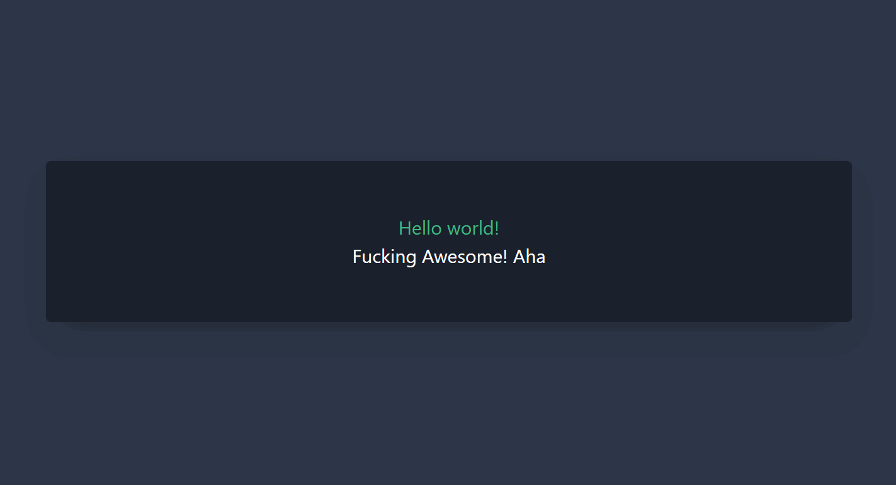

简体中文 | [English](./README.md)

<h1 align="center">vue-typical</h1>

<p align="center">一个仅有 400 bytes 🐡 JavaScript 的 Vue 自动打字动画效果。 <a href="https://vue-typical.vercel.app/" target="_blank">效果 &rarr;</a></p>

<p align="center">
  <a href="https://www.npmjs.com/package/vue-typical" target="_blank"></a>   <a href="https://www.jsdelivr.com/package/npm/vue-typical" target="_blank"></a>
</p>

[](https://vue-typical.vercel.app/)
## 📦 安装

你可以通过 npm 安装这个依赖：

```bash
npm install vue-typical
```

或者直接使用 cdn：

```html
<script src="https://cdn.jsdelivr.net/npm/vue-typical@latest/dist/typical.umd.min.js"></script>
```

## 🚀 用法

```html
<typical
  :steps="['Hello', 1000, 'Hello world!', 500]"
  :wrapper="'h2'"
></typical>
<typical
  class="typicalWrapper"
  :steps="['Fucking', 1000, 'Fucking Awesome!', 500, 'Fucking Awesome! Aha :-) 👋', 1000]"
  :loop="Infinity"
  :wrapper="'h3'"
></typical>
```

[](https://codesandbox.io/s/vue-typical-cqj9q?fontsize=14&hidenavigation=1&module=%2Fsrc%2FApp.vue&theme=dark)

## 📑 属性

| Prop|Required|Type|Eg.|
|--|--|--|--|
|`steps`|True|Array<String \| Number \| Function>|`['Hello', 1000, () => alert('Word')]`|
|`loop`|False|Number|`1` or `'Infinity'` |
|`wrapper`|False|String|`'div'`|

## ✨ 样式

想要光标闪烁效果，可以给标签加上 `typicalWrapper` CSS 类名.

```css
.typicalWrapper::after {
  content: "|";
  animation: blink 1s infinite step-start;
}

@keyframes blink {
  50% { opacity: 0; }
}
```

## 🔨 贡献

```npm
npm install
```

### 开发环境打包

```npm
npm run serve
```

### 生产环境打包

```npm
npm run build
```

## ❤️ 贡献者

Thanks goes to these people (emoji key):

<table>
  <tr>
    <td align="center">
      <a href="https://github.com/Turkyden">
        <br />
        <sub><b>Turkyden</b></sub></a><br />
        💻📖🚇⚠️
    </td>
    <td align="center">
      <a href="https://github.com/KnowsCount">
        <br />
        <sub><b>KnowsCount</b></sub></a><br />
        📖
    </td>
  </tr>
</table>  

## 版权

该库基于 [@camwiegert/typical](https://github.com/camwiegert/typical)，不过是一个 vue 版本。

受到 [@catalinmiron/react-typical](https://github.com/catalinmiron/react-typical) 的启发。

[MIT](https://github.com/Turkyden/vue-typical/blob/main/LICENSE) © [Turkyden](https://github.com/Turkyden)
